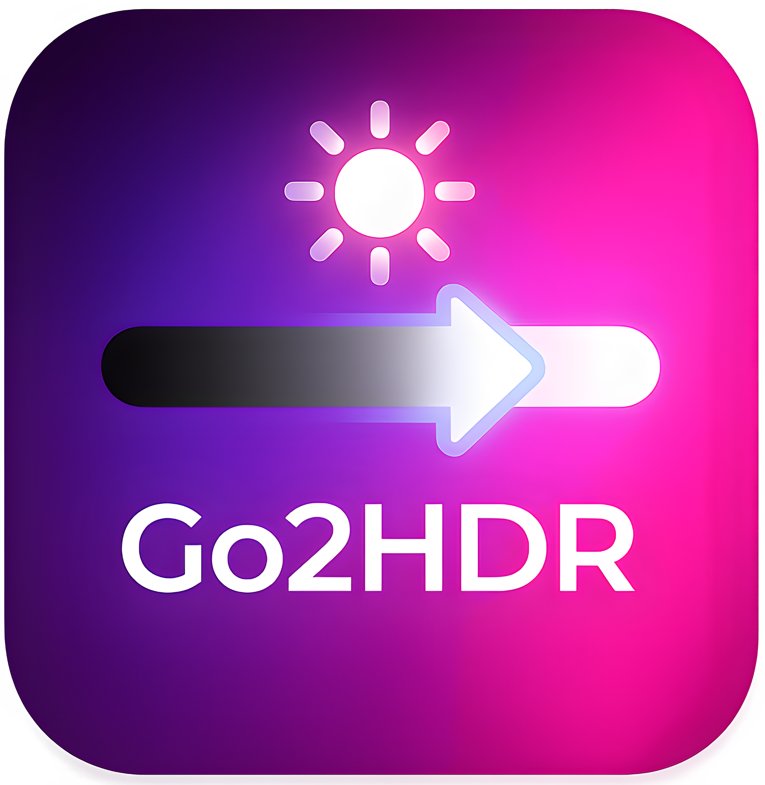
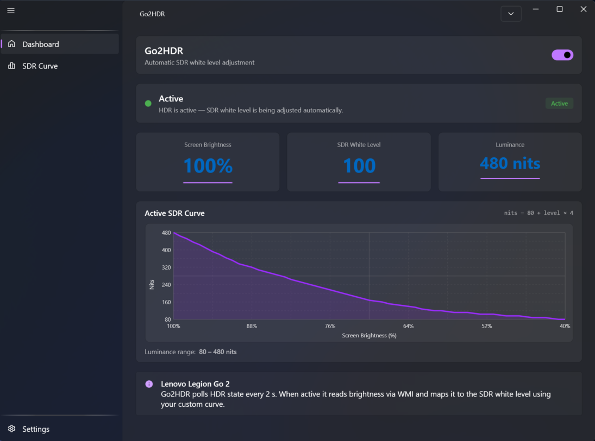
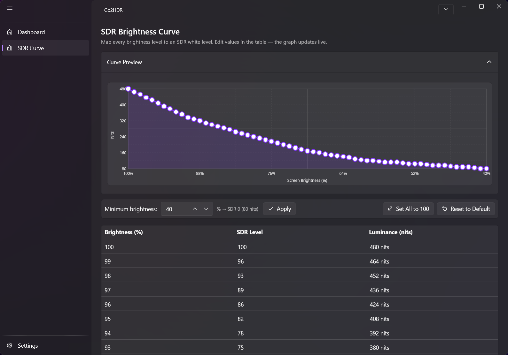
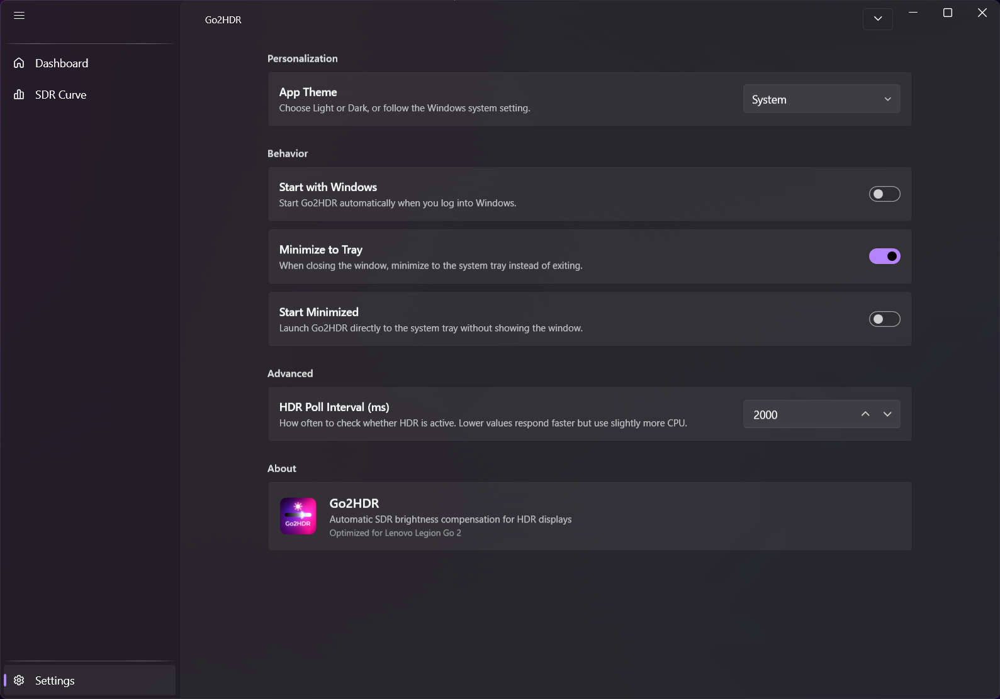

<div align="center">
  
  <h1>Go2HDR</h1>
  <p>Automatic SDR white level compensation for HDR displays on Lenovo Legion Go 2</p>

  
  
  
</div>

---

## The Problem

When HDR is enabled on the Lenovo Legion Go 2, SDR content (most games, apps, the Windows desktop) can appear washed out or incorrectly bright. This happens because Windows does not automatically adjust the **SDR white level** to match the display's current brightness setting — the value stays fixed while brightness can be anywhere from 0 to 100 %.

## What Go2HDR Does

Go2HDR runs in the background and continuously monitors your screen brightness. Whenever HDR is active and brightness changes, it immediately applies the correct SDR white level via the Windows **DisplayConfig API** — keeping SDR content looking natural at every brightness level, with no manual interaction required.

---

## Features

- **Automatic SDR adjustment** — reacts to HDR activation and brightness changes in real time
- **Custom brightness-to-SDR curve** — tune the mapping precisely to your display and preference
- **Live dashboard** — shows current brightness, SDR level, and luminance at a glance
- **System tray** — runs quietly in the background; double-click the tray icon to restore
- **Autostart with Windows** — optional, toggled from the Settings page
- **Minimize to tray** — closing the window keeps it running; fully exits from the tray menu
- **Fluent design UI** — built with WPF-UI 4.3, respects your Windows accent colour and theme

---

## Screenshots
<div align="center">
  
  
  
</div>


---

## Requirements

| | |
|---|---|
| **Device** | Lenovo Legion Go 2 |
| **OS** | Windows 10 version 1903 or later; Windows 11 recommended |
| **Runtime** | .NET 10 is bundled — no separate installation required |
| **Architecture** | x64 |

---

## Installation

### Installer (recommended)

1. Download `Go2HDR-Setup-x.x.x.exe` from the [Releases](../../releases) page.
2. Run the installer — it will:
   - install Go2HDR to `C:\Program Files\Go2HDR\`
   - create a Start Menu shortcut
   - optionally create a Desktop shortcut
   - install the Visual C++ 2022 runtime if not already present
   - close any running instance automatically if needed

### Portable

Download and run `Go2HDR.exe` directly from the [Releases](../../releases) page. No installation needed, but autostart and uninstall require the installer version.

---

## Building from Source

### Prerequisites

- [.NET 10 SDK](https://dotnet.microsoft.com/download/dotnet/10.0)
- Windows 10 / 11

### Build

```powershell
git clone https://github.com/Rayekkk/Go2HDR
cd Go2HDR
dotnet build -c Release
```

### Build the installer

1. Install [Inno Setup 6](https://jrsoftware.org/isinfo.php)
2. Download [`VC_redist.x64.exe`](https://aka.ms/vs/17/release/vc_redist.x64.exe) into `Installer\redist\`
3. Run the build script:

```powershell
.\build-installer.ps1
```

The installer will appear in `Installer\Output\`.

---

## How It Works

### SDR white level

Windows exposes the SDR white level through `DisplayConfigSetDeviceInfo` with the `DC_SET_SDR_WHITE_LEVEL` request. The raw value passed to the API is calculated as:

```
nits   = 80 + sdrLevel × 4
raw    = nits × 1000 / 80
```

Where `sdrLevel` is a 0–100 value read from the user-configured brightness curve.

### Brightness detection

Screen brightness changes are detected via WMI (`WmiMonitorBrightness`). An event watcher fires immediately when the display driver reports a change — no polling delay.

### HDR state detection

HDR activation is detected by polling `DisplayConfigGetDeviceInfo` (`DC_GET_ADVANCED_COLOR_INFO`) on a configurable interval (default: 2 s). When HDR turns on or the app starts with HDR active, the SDR level is applied immediately.

### Brightness curve

The SDR Curve page lets you define a piecewise linear mapping from screen brightness (%) to SDR level (0–100). The table is editable row by row; the graph updates live as you type. Changes are auto-saved.

---

## Project Structure

```
Go2HDR/
├── Assets/                  Icons and images
├── Converters/              WPF value converters
├── Installer/               Inno Setup script and build output
│   └── redist/              Place VC_redist.x64.exe here (not tracked by git)
├── Models/                  AppSettings, CurvePoint
├── Properties/PublishProfiles/  dotnet publish profile (win-x64)
├── Services/
│   ├── AutostartService     Windows registry autostart
│   ├── BrightnessService    WMI brightness watcher
│   ├── DisplayConfigService DisplayConfig P/Invoke (HDR detection + SDR apply)
│   ├── HdrService           Coordinator: polling, events, SDR refresh
│   └── SettingsService      JSON persistence + curve interpolation
├── ViewModels/              MVVM ViewModels (CommunityToolkit.Mvvm)
├── Views/
│   ├── Controls/CurveEditor Interactive canvas curve editor
│   └── Pages/               Dashboard, SDR Curve, Settings pages
├── build-installer.ps1      Build script: dotnet publish → Inno Setup
└── Go2HDR.csproj
```

---

## Contributing

Pull requests are welcome. For significant changes, please open an issue first to discuss what you'd like to change.

---

## License

[MIT](LICENSE)
